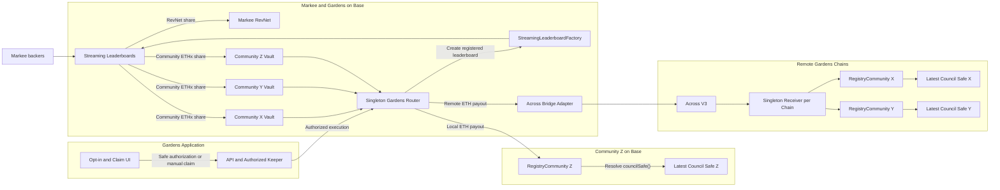
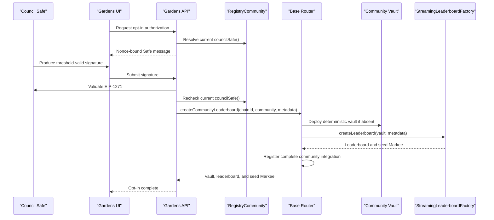
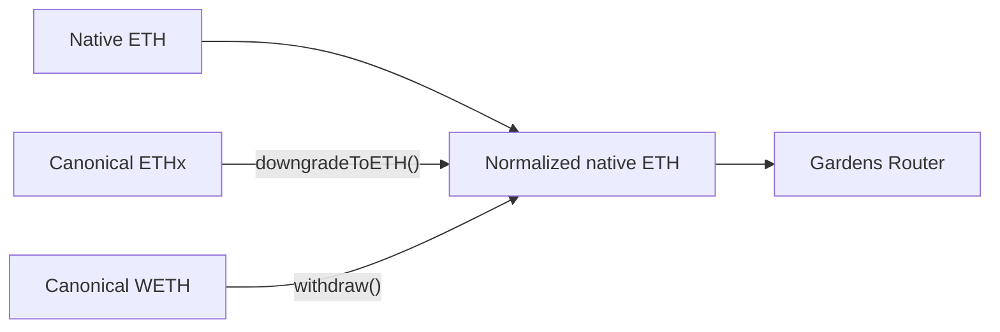
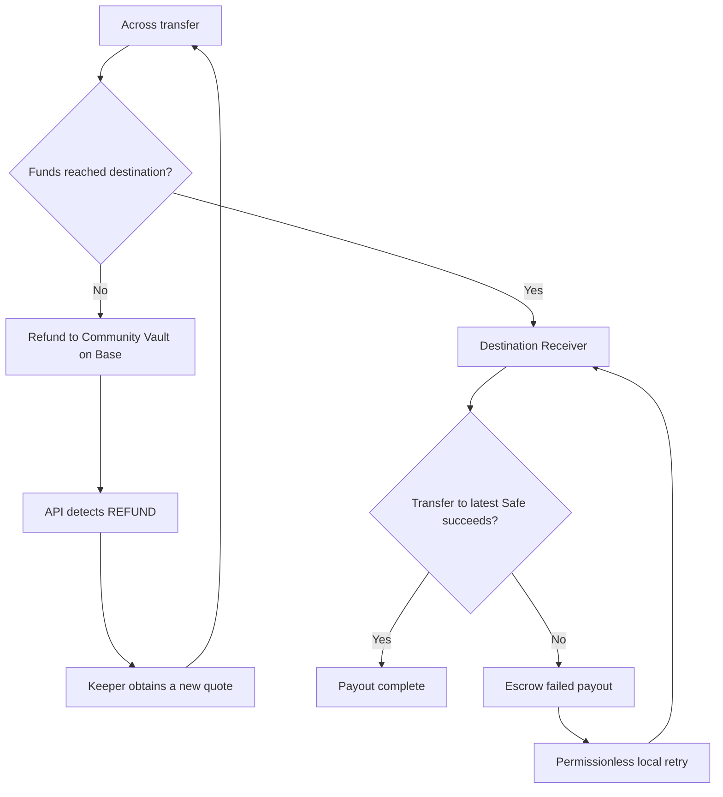

# Gardens × Markee Streaming Revenue Integration — V1

## Summary

Gardens communities can opt into a Markee `StreamingLeaderboard` whose community revenue share is streamed to a dedicated vault on Base. A singleton Gardens router atomically deploys or reuses the community vault, creates the leaderboard through its configured streaming leaderboard factory, and registers the complete community integration on Base. Revenue is automatically delivered to the community's latest council Safe when the effective bridge cost is at most 1% of accumulated revenue. The council Safe or any current Safe member can request an earlier manual claim after accepting the quoted fee.

V1 integrates only the streaming leaderboard strategy. The Gardens community receives ETH revenue; MARKEE issuance remains with backers and the Markee platform.

## Locked V1 Decisions

- One deterministic `CommunityRevenueVault` per Gardens community on Base.
- Community identity is `keccak256(abi.encode(communityChainId, registryCommunity))`.
- Only `StreamingLeaderboard` is offered during opt-in.
- The singleton `GardensMarkeeRouter` is the only integration entrypoint: it deploys or reuses the vault, creates the leaderboard, and registers the community association atomically.
- The router stores a settable `StreamingLeaderboardFactory` address. Only the effective Gardens owner may update it, and updates affect only future leaderboard creation.
- The router stores the canonical `communityKey -> { communityChainId, registryCommunity, vault, factory, leaderboard, seedMarkee }` registration.
- Because the router calls the factory, it is the initial leaderboard admin and seed Markee owner. Any admin action or ownership handoff exposed by the router is restricted to the effective Gardens owner and emits an audit event.
- The leaderboard's `beneficiaryAddress` is the community vault.
- The vault normalizes native ETH, canonical Base ETHx, and canonical Base WETH into native ETH.
- Canonical Base ETHx: `0x46fd5cfB4c12D87acD3a13e92BAa53240C661D93`.
- Canonical Base WETH: `0x4200000000000000000000000000000000000006`.
- Only the singleton Gardens router can release revenue from a vault.
- Vault normalization and release are reentrancy-protected and atomic.
- A keeper automatically sweeps when effective bridge cost is at most 1% of available revenue.
- A manual claim may be initiated by the council Safe or any current Safe owner.
- Manual claims may exceed 1% only when the signer accepts explicit maximum fee limits.
- Bridge fees are deducted from community revenue; the keeper pays its own Base transaction gas.
- Base communities are paid locally without bridging.
- Remote payouts resolve `RegistryCommunity.councilSafe()` on the destination chain at delivery time.
- V1 bridge execution is keeper-only. Permissionless sponsored bridging is deferred.
- No MARKEE tokens are sent or bridged to the council Safe.

## Big-Picture Architecture



## Workstream A — Opt-In and Leaderboard Creation

### User experience

The opt-in modal contains no strategy, payout-mode, threshold, or bridge configuration options. It explains only the product behavior:

> Markee is a streaming leaderboard where supporters stream funds toward community messages. The message receiving the most support takes the top position.
>
> A share of the winning stream goes to your community. Revenue is automatically sent to the council Safe once enough has accumulated. Council Safe members can also claim it manually.

The primary action is **Create Markee leaderboard**.

### Authorization

Opt-in requires a threshold-valid signature from the current council Safe. An individual Safe member cannot authorize opt-in alone.

Because remote community Safes cannot directly transact on Base, the flow is:

1. Gardens API reads the latest `RegistryCommunity.councilSafe()` on the community chain.
2. API creates a nonce-bound, expiring EIP-712 opt-in message.
3. The council Safe produces a threshold-valid signature.
4. API validates the signature through EIP-1271 on the community chain.
5. API rechecks the latest council Safe and consumes the nonce.
6. The authorized Gardens keeper calls the singleton router on Base.
7. The router derives the community key and atomically:
   - deploys or reuses the deterministic community vault;
   - calls its configured `StreamingLeaderboardFactory` with the vault as `beneficiaryAddress`;
   - registers the chain ID, RegistryCommunity, vault, factory, leaderboard, and seed Markee.
8. The API stores the router transaction identifier and mirrors the canonical on-chain registration for indexing and status reporting.



### Opt-in message

The signed authorization binds at least:

```solidity
struct OptInAuthorization {
    bytes32 communityKey;
    uint256 communityChainId;
    address registryCommunity;
    bytes32 leaderboardMetadataHash;
    uint256 nonce;
    uint256 deadline;
}
```

Creation must be idempotent. If a community is already registered, the router returns the existing vault, leaderboard, and seed Markee without creating duplicates. Vault deployment, factory creation, and registration occur in one transaction, so a factory failure reverts the entire new-community registration. A factory-address update cannot alter an existing registration.

## Workstream B — Community Share and Bridging

### Vault normalization

Each community vault counts all three supported Base ETH forms as revenue:



The vault:

- Accepts the streaming beneficiary flow as ETHx.
- Accepts native ETH and WETH transfers or refunds.
- Reports native ETH, positive available ETHx, WETH, and combined revenue.
- Downgrades all available ETHx and unwraps all WETH during release.
- Allows only the Gardens router to call `releaseRevenue()`.
- Uses reentrancy protection because ETHx and WETH normalization return native ETH.
- Reverts normalization and release atomically on failure.

### Automatic slow path

The API periodically fetches a fresh Across quote for each opted-in remote community and automatically sweeps when:

```text
effectiveBridgeCost / availableRevenue <= 1%
```

Effective bridge cost includes destination execution, cross-chain execution, and route or swap loss. It excludes the keeper's Base transaction gas.

If the ratio exceeds 1%, revenue remains in the vault and continues accumulating. Base communities have no bridge fee and are paid locally by the keeper.

### Manual claim

A manual claim may be requested by:

- The current council Safe, validated through EIP-1271.
- Any current Safe owner, validated through `Safe.isOwner()`.

The signed claim binds:

```solidity
struct ClaimAuthorization {
    bytes32 communityKey;
    address vault;
    uint256 maxFee;
    uint16 maxFeeBps;
    uint256 nonce;
    uint256 deadline;
}
```

Before execution, the API refreshes the quote, rechecks the latest Safe or current membership, and rejects any quote exceeding the signed limits. The claimant cannot specify a beneficiary; delivery always targets the latest registered council Safe.

### Bridge interface

The generic adapter accepts native ETH only:

```solidity
interface IBridgeAdapter {
    function bridgeETH(
        BridgeRequest calldata request,
        bytes calldata quoteData
    ) external payable returns (bytes32 transferId, uint256 expectedAmountOut);
}
```

The Across adapter deposits native ETH into the origin SpokePool as canonical WETH, binds the originating vault as the depositor/refund address, and passes a payout identifier plus the community identity to the destination receiver. Quote output, deadline, destination token, destination receiver, and minimum output are validated before deposit.

### Destination delivery

There is one shared receiver on every supported remote Gardens chain. It authenticates the destination Across SpokePool, verifies the configured wrapped-native token, unwraps the exact delivered amount, resolves the latest council Safe, and forwards native ETH.

If the Safe transfer fails, the receiver catches the failure instead of reverting the Across callback. It records the amount against `payoutId` and `communityKey`, then permits a permissionless local retry that resolves the latest Safe again.

### Failure handling



- If the source transaction reverts, funds never leave the vault.
- If Across expires the deposit before destination delivery, the depositor/refund address is the originating community vault.
- Wrapped-native refunds are normalized by the vault on the next sweep.
- If funds arrive but the Safe transfer fails, retry is local and does not invoke Across again.
- A maintainer recovery function applies only to recorded failed payouts and emits a complete audit event.

## Contracts and Ownership

| Component | Deployment | Upgrade policy | Owner/access |
|---|---|---|---|
| `CommunityRevenueVault` | One deterministic clone per community on Base | Non-upgradeable clone | Router-only release |
| `GardensMarkeeRouter` | Singleton on Base; deploys vault clones and creates/registers leaderboards | UUPS via `ProxyOwnableUpgrader` | Authorized keeper for creation; Gardens Base `ProxyOwner` for factory/configuration and leaderboard administration |
| `AcrossBridgeAdapter` | Replaceable adapter on Base | Replace by router configuration | Router-only execution; owner-configured destination token allowlist |
| `GardensRevenueReceiver` | Singleton per remote chain | UUPS via `ProxyOwnableUpgrader` | Chain-local Gardens `ProxyOwner` |

The effective Gardens owner manages keeper authorization, the settable streaming leaderboard factory, leaderboard administration, and adapter/receiver configuration. The factory setter rejects the zero address and addresses without contract code. Successful router and adapter calls must not retain community revenue.

## Supported Destinations

| Community chain | Chain ID | Delivery asset |
|---|---:|---|
| Base | 8453 | Native ETH, local payout |
| Ethereum | 1 | Native ETH |
| Optimism | 10 | Native ETH |
| Arbitrum | 42161 | Native ETH |
| Polygon | 137 | Canonical/approved WETH |

Across currently exposes Base routes for Ethereum, Optimism, Arbitrum, and Polygon. Gnosis and Celo are deferred until Across supports those routes or a second adapter is selected. Route availability, refund behavior, destination WETH, SpokePool addresses, and quote limits must be validated live before enabling a chain. Ethereum Sepolia to Arbitrum Sepolia was exercised end to end with the destination callback; Optimism Sepolia is configured but Across testnet relayer availability is not reliable enough to make it a rollout gate.

## Two-Developer Split

### Developer 1 — Opt-in flow

- Build the simplified Gardens opt-in modal and Safe signing states.
- Implement challenge, signature validation, nonce, deadline, and idempotency APIs.
- Validate the latest council Safe through `RegistryCommunity` and EIP-1271.
- Submit the authorized atomic router creation call and decode its registration event.
- Persist a query/indexing mirror of the router's canonical community-to-vault-to-leaderboard registration and creation status.
- Test valid quorum, insufficient signatures, stale Safe, replay, expiry, idempotent retries, and atomic rollback when factory creation fails.

### Developer 2 — Community split bridge

- Implement vault normalization, router, bridge adapter, and destination receiver contracts.
- Implement the 1% automatic quote/keeper path.
- Implement council Safe and Safe-member manual claims.
- Implement Across deposit-status reconciliation, Base-vault refunds, and fresh-route retry.
- Implement destination failed-payout escrow, permissionless retry, and maintainer recovery.
- Test accounting, access control, refunds, duplicate delivery, Safe rotation, and all destination assets.

### Shared seam

Developer 2 publishes this interface and a mock first. The router is the canonical registry and the only contract that calls the streaming leaderboard factory for Gardens opt-ins:

```solidity
interface IGardensMarkeeRouter {
    struct CommunityIntegration {
        uint256 communityChainId;
        address registryCommunity;
        address vault;
        address factory;
        address leaderboard;
        address seedMarkee;
    }

    event CommunityLeaderboardRegistered(
        bytes32 indexed communityKey,
        uint256 indexed communityChainId,
        address indexed registryCommunity,
        address vault,
        address factory,
        address leaderboard,
        address seedMarkee
    );

    event StreamingLeaderboardFactoryChanged(
        address indexed oldFactory,
        address indexed newFactory
    );

    function createCommunityLeaderboard(
        uint256 communityChainId,
        address registryCommunity,
        string calldata leaderboardName,
        string calldata platformId
    ) external returns (
        address vault,
        address leaderboard,
        address seedMarkee
    );

    function communityIntegration(bytes32 communityKey)
        external
        view
        returns (CommunityIntegration memory integration);

    function streamingLeaderboardFactory()
        external
        view
        returns (address factory);

    function setStreamingLeaderboardFactory(address newFactory) external;
}
```

`createCommunityLeaderboard` is authorized-keeper-only and uses the router's configured factory; callers cannot supply an arbitrary factory or beneficiary. The router passes the deterministic community vault as beneficiary and the fixed platform name `Gardens`, then records the factory actually used. Existing registrations are returned unchanged. Both workstreams use the same community-key algorithm and event identifiers.

## Assumptions

- Streaming leaderboard factory, vault implementation, router, and adapter are deployed on Base.
- The router's streaming leaderboard factory variable is configured before opt-in is enabled.
- All supported Gardens communities expose `RegistryCommunity.councilSafe()`.
- Council Safes support threshold-valid EIP-1271 signatures and owner lookup.
- The Gardens keeper is funded with Base ETH and is operationally trusted to submit validated routes.
- Across exposes a live quote within the configured limits for every enabled Base route.
- The Across deposit binds the originating vault as depositor/refund recipient.
- Polygon communities accept the configured wrapped ETH representation.
- The API safely persists consumed nonces, an indexing mirror of router community registrations, claims, quotes, and transfer status.
- Threshold policy stays off-chain; contracts enforce quote validity, destination integrity, minimum output, and funds conservation.

## Definition of Done

### Opt-in

- The modal contains only the product explanation and create action.
- A threshold-valid current council Safe can opt in.
- One Safe owner alone cannot opt in.
- Replayed, expired, and stale-Safe authorizations are rejected; duplicate router execution returns the existing registration.
- The deterministic vault is created or reused.
- The streaming leaderboard is created with that vault as beneficiary.
- The router atomically registers the chain ID, RegistryCommunity, vault, factory, leaderboard, and seed Markee.
- Repeated creation returns the existing registration without duplicate vaults or leaderboards.
- A failed factory call leaves no partial new-community registration.

### Revenue and claims

- ETHx, native ETH, and WETH balances are included and normalized correctly.
- Only the router can release vault revenue, with reentrancy protection.
- Automatic remote sweeps occur only at an effective fee ratio of 1% or less.
- Manual claims verify the Safe or current owner and honor signed fee limits.
- Base communities receive native ETH locally.
- Remote communities receive the configured asset at the latest council Safe.
- Council Safe rotation before delivery targets the new Safe.

### Failures and operations

- Source reverts preserve funds in the vault.
- Expired pre-delivery Across deposits refund the correct community vault.
- Refunded WETH is included in the next normalization.
- Safe-transfer failures are escrowed without reverting destination delivery.
- Permissionless retry cannot change the community or beneficiary.
- Maintainer recovery cannot withdraw unrelated funds.
- Transfer, refund, escrow, retry, and recovery events are monitored.
- Low-value canaries succeed on every supported destination before general rollout.
